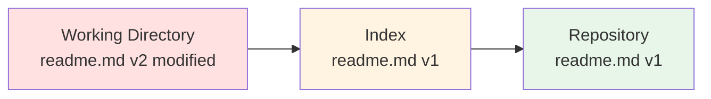
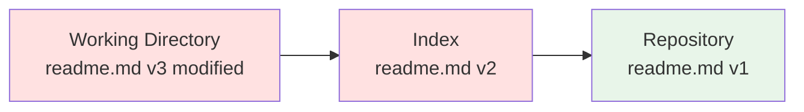

# Understanding Git's Tree Structure

When you use git, we often talk about working branches. We use this term because git is composed of 3 spaces, which we call trees!

1. The working directory: this is where we make our modifications
2. The index (or stage): Validation space for our work
3. The repository: Space where validated work is stored

Currently, your git repository should be in this state:


Let's make some modifications to our readme.md file.

Add the lines you want in it and save it. You can observe the command output:

```bash
$ git status
On branch master
Changes not staged for commit:
  (use "git add <file>..." to update what will be committed)
  (use "git restore <file>..." to discard changes in working directory)
	modified:   readme.md

no changes added to commit (use "git add" and/or "git commit -a")
```

Your repository is now in this state:



Add the readme.md file to the index using the *git add* command and make another modification to it:

Your repository will then be in this state:



Finally, use the *git add* command to add readme.md and make a commit to validate the modifications:

```bash
$ git add readme.md
$ git commit -m "Added lines to readme.md file"
```

Your git repository will now be in this state:


**Note**
You can see that the readme.md file was validated directly in version 3 without v2 being in the repository.

You can see that you only have 2 commits in your history:

```bash
$ git log
commit 6b6a4c8dad91934dfdc1d01fc2efd13a769009ee (HEAD -> master)
Author: John Doe <John@doe.com>
Date:   Wed Mar 15 13:34:09 2023 +0100

    Added lines to readme.md file

commit 878cffad18ea9d1b4f2a0ff24a1dd61f258a0af3
Author: John Doe <John@doe.com>
Date:   Wed Mar 15 11:24:04 2023 +0100

    My first commit
```

## Visualizing Git History

The *git log* command may not be very friendly at first glance. You can use options to get more concise information:
```bash
$ git log --oneline --graph --decorate
* 6b6a4c8 (HEAD -> master) Added lines to readme.md file
* 878cffa My first commit
```

I recommend creating an alias for later use:
```bash
$ git config --global alias.lg "log --oneline --graph --decorate"
```

Conversely, if you want more information about a commit, you can use the *git show [commit]* command to see all the info about it.

**Warning** your commit numbers will be different from mine!!
```bash
$ git show 6b6a4c8
commit 6b6a4c8dad91934dfdc1d01fc2efd13a769009ee (HEAD -> master)
Author: John Doe <John@doe.com>
Date:   Wed Mar 15 13:34:09 2023 +0100

    Added lines to readme.md file

diff --git a/readme.md b/readme.md
index e69de29..fe73258 100644
--- a/readme.md
+++ b/readme.md
@@ -0,0 +1,4 @@
+# Readme for my awesome project
+
+I am the 1st line of the readme
+I am the 2nd line of the readme
```

## Ignoring Files in the Tree

Sometimes we want certain files in the repository to be invisible to git, for example environment variables, cache, compiled files.

Git offers the ability to ignore files using *.gitignore*

Create a .gitignore file, add a line \*.nop in it and commit your changes:
```bash
$ vim .gitignore
# *.nop
$ git add .gitignore
$ git commit -m "Added gitignore"
```

Once done, create a *fichier.nop* file and observe the output of the *git status* command:
```bash
$ touch fichier.nop
$ git status
On branch master
nothing to commit, working tree clean
```
Files with the .nop extension are properly ignored by git!

---

**Previous:** [← My Very First Commit](02-first-commit.md) | **Next:** [Branches and the HEAD Position →](04-branches-and-head.md)

