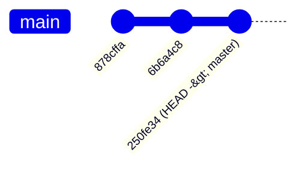
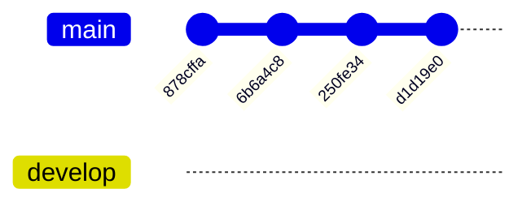
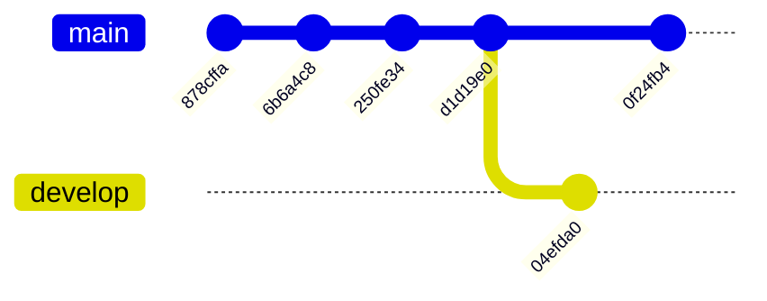
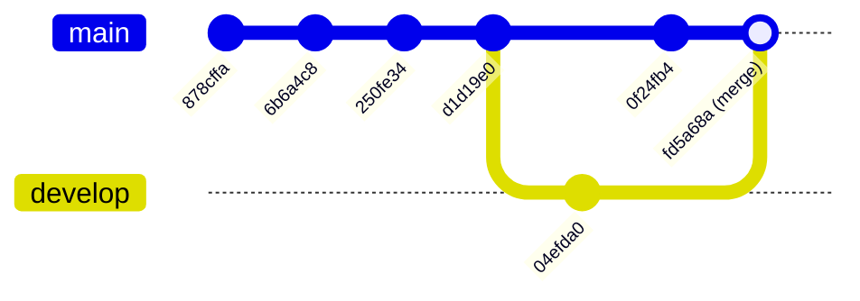

# Branches and the HEAD Position

## HEAD

I think you've noticed the **(HEAD -> master)** in your log command outputs. This indication gives you the position of git's read head (HEAD).

```bash
git lg
* 250fe34 (HEAD -> master) Added gitignore
* 6b6a4c8 Added lines to readme.md file
* 878cffa My first commit
```

This read head can be moved using the *git checkout <position>* command.

There are several ways to manipulate the read head:

1. git checkout 6b6a4c8: the HEAD reference moves to commit 6b6a4c8
2. git checkout HEAD^: the HEAD reference moves one step to the left (HEAD^ designates the commit preceding HEAD)
3. git checkout master: the HEAD reference moves to the master reference, i.e., the head of the history



**Note**

Note that the HEAD^ reference designates the commit preceding HEAD, so HEAD^^ designates the commit preceding HEAD^, etc...

## Working Branches

When working on a project, we don't want our work in progress to influence what has been validated.

To address this, git uses a branch system that allows creating new references to a succession of commits.

The good practice is therefore to create a new working branch for each improvement and to bring back your work once validated.

Let's create a new working branch and move to its reference:
```bash
$ git branch develop
$ git checkout develop
```

**Note**
You can create and move to a new branch directly with:
```bash
$ git checkout -b develop
```

If we observe the logs, we notice that the HEAD reference now points to the *develop* branch:

```bash
$ git lg
* 250fe34 (HEAD -> develop, master) Added gitignore
* 6b6a4c8 Added lines to readme.md file
* 878cffa My first commit
```

Let's add [this file](../files/script.js) to our repository (don't panic if you don't know javascript, we'll stick to simple code!):

```bash
$ git add script.js
$ git commit -m "added script.js file"
$ git lg
* d1d19e0 (HEAD -> develop) added script.js file
* 250fe34 (master) Added gitignore
* 6b6a4c8 Added lines to readme.md file
* 878cffa My first commit
```

So you see that our modification created a new commit and separated the master and develop branches, but how do we link them again?

### Merging Branches Without Conflicts

Currently, your tree looks like this:



Git allows you to merge your working branches when you've finished working on one of them.
To do this, move to the master branch and merge the develop branch onto it:

```bash
$ git checkout master
$ git merge develop
$ git lg
* d1d19e0 (HEAD -> master, develop) added script.js file
* 250fe34 Added gitignore
* 6b6a4c8 Added lines to readme.md file
* 878cffa My first commit
```

### Merging Branches With Conflicts

Modify line 6 of *script.js* and commit your change on your master branch:

```bash
$ vim script.js
# console.log("result: "+ multiply(8,6));
$ git add script.js
$ git commit -m "changed numbers to multiply"
$ git lg
* 0f24fb4 (HEAD -> master) changed numbers to multiply
* d1d19e0 (develop) added script.js file
* 250fe34 Added gitignore
* 6b6a4c8 Added lines to readme.md file
* 878cffa My first commit
```

Go to your develop branch and do the same with different numbers:

```bash
$ git checkout develop
$ vim script.js
# console.log("result: "+ multiply(7,4));
$ git add script.js
$ git commit -m "changed numbers to multiply by 7 and 4"
$ git lg
* 04efda0 (HEAD -> develop) changed numbers to multiply by 7 and 4
* d1d19e0 added script.js file
* 250fe34 Added gitignore
* 6b6a4c8 Added lines to readme.md file
* 878cffa My first commit
```

If you want to see all your working branches, you can use the *--all* option of the *git log* command:
```bash
$ git lg --all
* 04efda0 (HEAD -> develop) changed numbers to multiply by 7 and 4
| * 0f24fb4 (master) changed numbers to multiply
|/
* d1d19e0 added script.js file
* 250fe34 Added gitignore
* 6b6a4c8 Added lines to readme.md file
* 878cffa My first commit
```

**Note**

I don't recommend adding this option to your *git lg* alias, we often need a clear visual of our logs.

Your tree now looks like this:



What happens if we want to merge develop into master now?

```bash
$ git checkout master
$ git merge develop
Auto-merging script.js
CONFLICT (content): Merge conflict in script.js
Recorded preimage for 'script.js'
Automatic merge failed; fix conflicts and then commit the result.
```

Git tells us there's a conflict, it's up to us to resolve it!

Open the *script.js* file, it should look like this:

```js
function multiply(a,b){
        console.log("we're going to multiply "+a+" and "+b)
        return a*b
}

<<<<<<< HEAD
console.log("result: "+ multiply(8,6));
=======
console.log("result: "+ multiply(7,4));
>>>>>>> develop
```

Git indicates in the file the lines that are in conflict and shows you the differences between HEAD and the merged branch.

Let's keep the line from the develop branch:
```js
function multiply(a,b){
        console.log("we're going to multiply "+a+" and "+b)
        return a*b
}

console.log("result: "+ multiply(7,4));
```

Save your file and add it to the index:

```bash
$ git add script.js
$ git status
On branch master
All conflicts fixed but you are still merging.
  (use "git commit" to conclude merge)

Changes to be committed:
	modified:   script.js

```

The status command clearly tells us that the file is added to the index. Use the *git merge --continue* command to tell git to continue the merge. Your editor opens and proposes a commit message. Validate it, the merge is complete!

```bash
$ git merge --continue
#Merge branch 'develop'
#
## Please enter a commit message to explain why this merge is necessary,
## especially if it merges an updated upstream into a topic branch.
##
## Lines starting with '#' will be ignored, and an empty message aborts
## the commit.
##
## On branch master
## Changes to be committed:
##       modified:   script.js
$ git lg
*   fd5a68a (HEAD -> master) Merge branch 'develop'
|\
| * 04efda0 (develop) changed numbers to multiply by 7 and 4
* | 0f24fb4 changed numbers to multiply
|/
* d1d19e0 added script.js file
* 250fe34 Added gitignore
* 6b6a4c8 Added lines to readme.md file
* 878cffa My first commit
```

**Note**
Note that unlike the merge without conflict, git had to create a merge commit to understand the conflict resolution strategy.

Your tree now looks like this:



---

**Previous:** [← Understanding Git's Tree Structure](03-git-tree-structure.md) | **Next:** [Going Back: Reset and Revert →](05-reset-and-revert.md)

