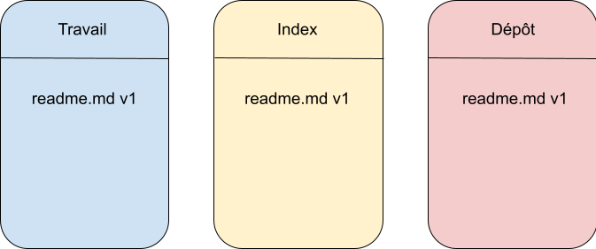

# Les Bases de Git

## Configurer son git

### Initialiser un repo git

Pour initialiser un repo git local, rien de plus simple:
```bash
$ git init gitrepo
$ cd gitrepo
```

### Identifier ses commits

Lorsque vous faites un commit sur git, il faut que l'on sache qui vous etes!
Vous pouvez vous identifer comme cela:
```bash
$ git config --global user.name "votre nom"
$ git config --global user.email email@email.com
```
### Personnalisé son git

Git permet un grand choix de personalisation, pour commencer, je vous invite a modifier votre éditeur ainsi que definir une stategie de push qui nous sera utile pour eviter certain warning plutard
```bash
$  config --global core.editor vim
$ git config --global push.default simple
```
### ajouter un prompt pour vos repos git

Récupérer ce [script](https://raw.githubusercontent.com/git/git/master/contrib/completion/git-prompt.sh) est installé le dans votre répértoire local puis ajouter ses lignes a votre ficher *~/.bachrc*

```sh
. ~/.git-prompt.sh
export GIT_PS1_SHOWDIRTYSTATE=1
export PS1='\[\e[1;32m\u@\h\]\e[m:\]\e[1;34m\w$(__git_ps1 " (%s)")\]\e[m\$\] \]'
```

Recharger son bashrc: 
```bash
source ~/.bashrc
```

## Mon tout premier commit

Pour votre premier commit nous allons créer un fichier readme.md
```bash
$ touch readme.md
```

vous pouvez regarder l'état de votre repo grâce à la commande
```bash
$ git status

Sur la branche master

Aucun commit

Fichiers non suivis:
  (utilisez "git add <fichier>..." pour inclure dans ce qui sera validé)
	readme.md

aucune modification ajoutée à la validation mais des fichiers non suivis sont présents (utilisez "git add" pour les suivre)
```
Sur le retour de la commande *git status* on voit bien qu'il n'y a aucun commit, et qu'il existe un nouveau fichier dans le dossier qui s'appel readme.md


Ajout le fichier readme.md et regarder l'état de la commande *git status*

```bash
$ git add readme.md
$ git status
Sur la branche master

Aucun commit

Modifications qui seront validées :
  (utilisez "git rm --cached <fichier>..." pour désindexer)
	nouveau fichier : readme.md
```

On a bien ajouter le fichier au repo git! Il ne manque plus qu'à créer notre premier commit

```bash
$ git commit -> ouvre vim pour editer son commit message
$ git commit -m "Mon premier commit" -> écrire directement un commit message
```
Vérifiez grace à la commande *git status* que plus rien n'est à valider


Vous pouvez voir votre 1er commit grace à la commande : 

```bash
$ git log
commit 878cffad18ea9d1b4f2a0ff24a1dd61f258a0af3 (HEAD -> master)
Author: valentin beauchamp <valentin@weaverize.com>
Date:   Wed Mar 15 11:24:04 2023 +0100

    Mon premier commit
```

## Comprendre l'arborescence de Git

Lorsque vous utilisez git, l'on parle souvent de branche de travail, on utilise ce terme car git est composé de 3 espaces, que l'on nomme arbre!

1. Le répertoire de travail : c'est ici que l'on fait nos modification
2. l'index (ou le stage) : Espace de validation de notre travail
3. Le dépot : Espace ou ce trouve le travail valider

Actuellement votre repertoire git doit se trouver dans cette état:




