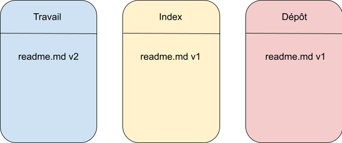
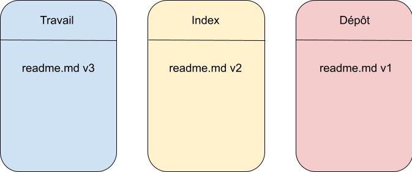
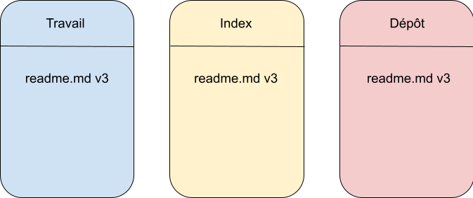
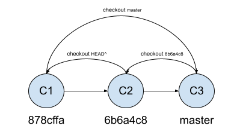
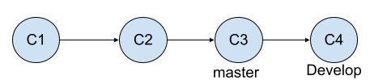
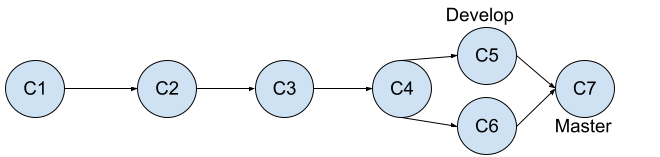

# Les Bases de Git

## Configurer son git

### Initialiser un repo git

Pour initialiser un repo git local, rien de plus simple:
```bash
$ git init gitrepo
$ cd gitrepo
```

### Identifier ses commits

Lorsque vous faites un commit sur git, il faut que l'on sache qui vous etes!
Vous pouvez vous identifer comme cela:
```bash
$ git config --global user.name "votre nom"
$ git config --global user.email email@email.com
```
### Personnalisé son git

Git permet un grand choix de personalisation, pour commencer, je vous invite a modifier votre éditeur ainsi que definir une stategie de push qui nous sera utile pour eviter certain warning plutard
```bash
$  config --global core.editor vim
$ git config --global push.default simple
```
### ajouter un prompt pour vos repos git

Récupérez ce [script](https://raw.githubusercontent.com/git/git/master/contrib/completion/git-prompt.sh) est installé le dans votre répértoire local puis ajouter ses lignes a votre ficher *~/.bachrc*

```sh
. ~/.git-prompt.sh
export GIT_PS1_SHOWDIRTYSTATE=1
export PS1='\[\e[1;32m\u@\h\]\e[m:\]\e[1;34m\w$(__git_ps1 " (%s)")\]\e[m\$\] \]'
```

Recharger son bashrc: 
```bash
source ~/.bashrc
```

## Mon tout premier commit

Pour votre premier commit nous allons créer un fichier readme.md
```bash
$ touch readme.md
```

vous pouvez regarder l'état de votre repo grâce à la commande
```bash
$ git status

Sur la branche master

Aucun commit

Fichiers non suivis:
  (utilisez "git add <fichier>..." pour inclure dans ce qui sera validé)
	readme.md

aucune modification ajoutée à la validation mais des fichiers non suivis sont présents (utilisez "git add" pour les suivre)
```
Sur le retour de la commande *git status* on voit bien qu'il n'y a aucun commit, et qu'il existe un nouveau fichier dans le dossier qui s'appel readme.md


Ajout le fichier readme.md et regarder l'état de la commande *git status*

```bash
$ git add readme.md
$ git status
Sur la branche master

Aucun commit

Modifications qui seront validées :
  (utilisez "git rm --cached <fichier>..." pour désindexer)
	nouveau fichier : readme.md
```

On a bien ajouter le fichier au repo git! Il ne manque plus qu'à créer notre premier commit

```bash
$ git commit -> ouvre vim pour editer son commit message
$ git commit -m "Mon premier commit" -> écrire directement un commit message
```
Vérifiez grace à la commande *git status* que plus rien n'est à valider


Vous pouvez voir votre 1er commit grace à la commande : 

```bash
$ git log
commit 878cffad18ea9d1b4f2a0ff24a1dd61f258a0af3 (HEAD -> master)
Author: valentin beauchamp <valentin@weaverize.com>
Date:   Wed Mar 15 11:24:04 2023 +0100

    Mon premier commit
```

## Comprendre l'arborescence de Git

Lorsque vous utilisez git, l'on parle souvent de branche de travail, on utilise ce terme car git est composé de 3 espaces, que l'on nomme arbre!

1. Le répertoire de travail : c'est ici que l'on fait nos modification
2. l'index (ou le stage) : Espace de validation de notre travail
3. Le dépot : Espace ou ce trouve le travail valider

Actuellement votre repertoire git doit se trouver dans cet état:


Faissons quelques modifications dans notre fichier readme.md 

Ajouter les lignes que vous souhaitez dedans et sauvegardez le, vous pouvez observer le retour de la commande:

```bash
$ git status
Sur la branche master
Modifications qui ne seront pas validées :
  (utilisez "git add <fichier>..." pour mettre à jour ce qui sera validé)
  (utilisez "git restore <fichier>..." pour annuler les modifications dans le répertoire de travail)
	modifié :         readme.md

aucune modification n'a été ajoutée à la validation (utilisez "git add" ou "git commit -a")
```

Votre repertoire se trouve donc dans cet état:



Ajoutez grâce à la commande *git add* le fichier readme.md dans l'index et faite une nouvelle modification de celui-ci

votre repertoire se trouvera ainsi dans cet état:




Pour finir utilisez la commande *git add* pour ajoutez le readme.md et faite un commit pour valider les modifications

```bash
$ git add readme.md
$ git commit -m "Ajout de lignes dans le fichier readme.md"
```

Votre repertoire git sera ainsi dans cette état:



**Remarque**
Vous pouvez voir que le fichier readme.md a été validé directement en version 3 sans que la v2 n'ai été dans le dépot

Vous pouvez voir que vous n'avez que 2 commits dans votre historique:

```bash
$ git log
commit 6b6a4c8dad91934dfdc1d01fc2efd13a769009ee (HEAD -> master)
Author: valentin beauchamp <valentin@weaverize.com>
Date:   Wed Mar 15 13:34:09 2023 +0100

    Ajout de lignes dans le fichier readme.md

commit 878cffad18ea9d1b4f2a0ff24a1dd61f258a0af3
Author: valentin beauchamp <valentin@weaverize.com>
Date:   Wed Mar 15 11:24:04 2023 +0100

    Mon premier commit
```

### Visualiser l'historique de git

La commande *git log* peut ne pas être très amical au premier abore, vous pouvez utiliser des options pour avoir des informations plus consise
```bash
$ git log --oneline --graph --decorate
* 6b6a4c8 (HEAD -> master) Ajout de lignes dans le fichier readme.md
* 878cffa Mon premier commit
```

Je vous conseil de créer un alias pour la suite : 
```bash
$ git config --global alias.lg "log --oneline --graph --decorate"
```

A l'inverse, si vous souhaitez plus d'information sur un commit, vous pouvez utiliser la commande *git show [commit]* pour voir tout les infos dessus

**Attention** vos numero de commit seront différent des miens!!
```bash
$ git show 6b6a4c8
commit 6b6a4c8dad91934dfdc1d01fc2efd13a769009ee (HEAD -> master)
Author: valentin beauchamp <valentin@weaverize.com>
Date:   Wed Mar 15 13:34:09 2023 +0100

    Ajout de lignes dans le fichier readme.md

diff --git a/readme.md b/readme.md
index e69de29..fe73258 100644
--- a/readme.md
+++ b/readme.md
@@ -0,0 +1,4 @@
+# Readme de mon super projet
+
+Je suis la 1er ligne du readme
+Je suis la 2eme lignes du readme
```

### Ignorer des fichiers dans l'arborescence

Parfois l'on souhaite que certain fichier du repertoire soit invisible pour git, par exemple de variable d'environement, du cache, des fichiers compilé.

Git offre la possibilité d'ignorer des fichiers grâce au *.gitignore*

créez un fichier .gitignore, ajoutez une ligne \*.nop dedans et commitez vos changement
```bash
$ vim .gitignore
# *.nop
$ git add .gitignore
$ git commit -m "Ajout du gitignore"
```

Une fois fait créez un fichier *fichier.nop* et observez le retour de la commande *git status*
```bash
$ touch fichier.nop
$ git status
Sur la branche master
rien à valider, la copie de travail est propre
```
Les fichiers qui portent l'extension .nop sont bien ignorés par git

## Les branches et la position de la tête de lecture

### HEAD

Je pense que vous avez remarqué le **(HEAD -> master)** dans vos retours de commande de log, cette indication vous donne la position de la tête de lecture de git (HEAD)

```bash
git lg
* 250fe34 (HEAD -> master) Ajout du gitignore
* 6b6a4c8 Ajout de lignes dans le fichier readme.md
* 878cffa Mon premier commit
```

Cette tête de lecture peut être déplacé grâce à la commande *git checkout <position>*

Il existe plusieurs manière de manipuler la tête de lecture:

1. git checkout 6b6a4c8 : la référence HEAD se déplace sur le commit 6b6a4c8
2. git checkout HEAD^ : la référence HEAD se déplace d'un cran vers le gauche (HEAD^ désigne le commit précédant HEAD)
3. git checkout master : la référence HEAD se déplace vers la référence master, c'est-à-dire la tête de l'historique




**Remarque**

Noté que la réference HEAD^ désigne le commit prédédant HEAD, ainsi HEAD^^ désigne le commit précédant HEAD^, etc...

### Branche de travail

Lorsque l'on travail sur un projet, on ne souhaite pas que son travail en cours influence ce qui a été validé.

Pour palier à cela, git utilise un système de branche qui permet de créer des nouvelles reférence à une succession de commit.

La bonne pratique de travail est donc de créer une nouvelle branche de travail pour chaque amélioration et de rappatrier son travail une fois validé

Créons une nouvelle branche de travail puis déplaçons nous sur sa référence
```bash
$ git branch develop
$ git checkout develop
```

**Note**
Vous pouvez créer et vous déplacer sur une nouvelle branche directement grâce à 
```bash
$ git checkout -b develop
```

Si l'on observe les logs, on remaque que la référence HEAD pointe maintenant sur la branche *develop*

```bash
$ git lg
* 250fe34 (HEAD -> develop, master) Ajout du gitignore
* 6b6a4c8 Ajout de lignes dans le fichier readme.md
* 878cffa Mon premier commit
```

Ajoutons [ce fichier](./files/script.js) dans notre répertoire( pas de panique si vous ne connaisez pas le javascript, on restera sur du code simple!)

```bash
$ git add script.j
$ git commit -m "ajout du fichier script.js"
$ git lg
* d1d19e0 (HEAD -> develop) ajout du fichier script.js
* 250fe34 (master) Ajout du gitignore
* 6b6a4c8 Ajout de lignes dans le fichier readme.md
* 878cffa Mon premier commit
```

Vous voyez donc que notre modification à créer un nouveau commit et détaché la branche master et develop, mais comment les lier de nouveau?

#### La fusion de branche sans conflits

Actuellement votre arborescence ressemble à cela:



Git permet de fusionner ses branches de travail lorsque l'on a fini de travailler sur l'un d'elle
Pour cela deplacer vous sur la branche master et merger la branche develop dessus

```bash
$ git checkout master
$ git merge develop
$ git lg
* d1d19e0 (HEAD -> master, develop) ajout du fichier script.js
* 250fe34 Ajout du gitignore
* 6b6a4c8 Ajout de lignes dans le fichier readme.md
* 878cffa Mon premier commit
```

#### La fusion de branche avec des conflits

Modifez la ligne 6 de *script.js* et commiter votre changement sur votre branche master

```bash
$ vim script.js
# console.log("résultat: "+ mutliplier(8,6)); 
$ git add scrip.js
$ git commit -m "changement de nombre à mutliplier"
$ git lg
* 0f24fb4 (HEAD -> master) changement de nombre à mutliplier
* d1d19e0 (develop) ajout du fichier script.js
* 250fe34 Ajout du gitignore
* 6b6a4c8 Ajout de lignes dans le fichier readme.md
* 878cffa Mon premier commit
```

Allez sur votre branche develop et faite de même avec d'autres chiffres

```bash
$ git checkout develop
$ vim script.js
# console.log("résultat: "+ mutliplier(7,4)); 
$ git add scrip.js
$ git commit -m "changement de nombre à mutliplier par 7 et 4"
$ git lg
* 04efda0 (HEAD -> develop) changement de nombre à mutliplier par 7 et 4
* d1d19e0 ajout du fichier script.js
* 250fe34 Ajout du gitignore
* 6b6a4c8 Ajout de lignes dans le fichier readme.md
* 878cffa Mon premier commit
```

Si vous souhaitez voir toutes vos branches de travail, vous pouvez utiliser l'option *--all* de la commande *git log*
```bash
$ git lg --all
* 04efda0 (HEAD -> develop) changement de nombre à mutliplier par 7 et 4
| * 0f24fb4 (master) changement de nombre à mutliplier
|/  
* d1d19e0 ajout du fichier script.js
* 250fe34 Ajout du gitignore
* 6b6a4c8 Ajout de lignes dans le fichier readme.md
* 878cffa Mon premier commit
```
**Remarque**

Je ne vous conseil pas d'ajouter cette option a votre alias *git lg*, on a souvent besoin d'un visuel claire de ses logs


Votre arborescence ressemble donc à cela:


Que ce passe s'il si l'on souhaite merger develop dans master maintenant

```bash
$ git checkout master
$ git merge develop
Fusion automatique de script.js
CONFLIT (contenu) : Conflit de fusion dans script.js
Pré-image enregistrée pour 'script.js'
La fusion automatique a échoué ; réglez les conflits et validez le résultat.
```

Git nous indique qu'il y a un conflit, c'est à nous de le résoudre!

Ouvrez le fichier *script.js*, il devrait ressembler à cela:

```js
function mutliplier(a,b){
        console.log("on va multipler "+a+" et "+b)
        return a*b
}

<<<<<<< HEAD
console.log("résultat: "+ mutliplier(8,6));
=======
console.log("résultat: "+ mutliplier(7,4));
>>>>>>> develop
```

Git vous indique dans le fichier les lignes qui rentre en conflit et vous indique les différences entre le HEAD et la branche mergé


Gardons la ligne qui se trouve dans la branche develop
```js
function mutliplier(a,b){
        console.log("on va multipler "+a+" et "+b)
        return a*b
}

console.log("résultat: "+ mutliplier(7,4));
```

Sauvegardez votre fichier et ajoutez le à l'index

```bash
$ git add script.js
$ git status
Sur la branche master
Tous les conflits sont réglés mais la fusion n'est pas terminée.
  (utilisez "git commit" pour terminer la fusion)

Modifications qui seront validées :
	modifié :         script.js

```

La commande status nous indique bien que le fichier est ajouté à l'index, utilisez la commande *git merge --continu* pour indiquer a git que continuer le merge, votre éditeur s'ouvre et vous propose un commit message, validé, le merge est terminé!

```bash
$ git merge --continu
#Merge branch 'develop'
#
## Veuillez saisir le message de validation pour vos modifications. Les lignes
## commençant par '#' seront ignorées, et un message vide abandonne la validation.
##
## Date :       Wed Mar 15 16:57:18 2023 +0100
##
## Sur la branche master
## Modifications qui seront validées :
##       modifié :         script.js
$ git lg
*   fd5a68a (HEAD -> master) Merge branch 'develop'
|\  
| * 04efda0 (develop) changement de nombre à mutliplier par 7 et 4
* | 0f24fb4 changement de nombre à mutliplier
|/  
* d1d19e0 ajout du fichier script.js
* 250fe34 Ajout du gitignore
* 6b6a4c8 Ajout de lignes dans le fichier readme.md
* 878cffa Mon premier commit
```

**Remarque**
Notez qu'à la différence de la fusion sans conflit, git a du créer un merge commit pour comprendre la statégie de résolution des conflits

Votre aborescence ressemble ainsi à cela:



## Revenir en arrière et garder un historique lineaire

### Supprimer un commit

Il existe une commande permettant de revenir en arrière et supprimer un commit 

```bash
$ git reset HEAD^
```

Il existe 3 options de reset dans git:
1. --soft : Le commit est supprimer mais les modifications sont stocké dans l'index en attente de validation
2. --mixed : mode par defaut, les modifications sont stocké dans le répertoire de travail
3. --hard : Les modifications sont supprimé ( à utilisé avec parcimonie )


